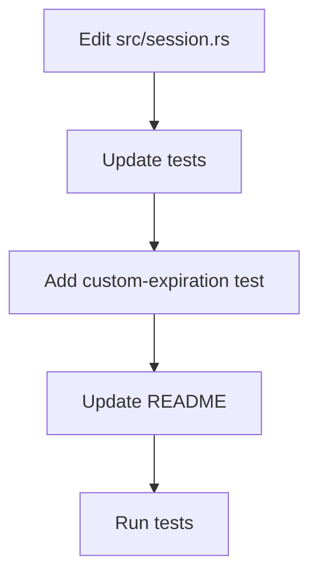

# Plan: add optional expiration_seconds to DpsAuthSession::create_payload

Date: 2025-11-14

Summary

This plan adds an optional parameter expiration_seconds: Option<i64> to
DpsAuthSession::create_payload so callers can override the default token
expiration. When not provided (None) the method will continue to use
DEFAULT_EXPIRATION_SECONDS.

Goals

- Add optional parameter expiration_seconds: Option<i64> to DpsAuthSession::create_payload.
- Default to DEFAULT_EXPIRATION_SECONDS when None or non-positive value.
- Update unit tests to exercise default and custom expiration behavior.
- Update README and doc-tests to reflect new signature and examples.
- Run tests and fix compilation issues.

Files to modify / create

- src/session.rs — change function signature, update doc comments and examples, update tests contained in this file.
- README.md — update usage examples.
- docs/llm/plans/2025/11/14-add-expiration-param.md — this file (plan).
- No new source files are required.

New public API (signature)

Use the following signature for the changed API:

```rust
pub fn create_payload(user_id: i64, expiration_seconds: Option<i64>) -> DpsAuthSessionPayload
```

Behavior

- If expiration_seconds is Some(n) and n > 0, use n as the lifetime in seconds.
- Otherwise use Self::DEFAULT_EXPIRATION_SECONDS.
- Compute exp = iat + effective_seconds.

Code sample to replace existing implementation (target: [`src/session.rs:178`](src/session.rs:178))

```rust
pub fn create_payload(user_id: i64, expiration_seconds: Option<i64>) -> DpsAuthSessionPayload {
  let current_time = chrono::Utc::now().timestamp();
  let effective_seconds = match expiration_seconds {
    Some(seconds) if seconds > 0 => seconds,
    _ => Self::DEFAULT_EXPIRATION_SECONDS,
  };

  DpsAuthSessionPayload {
    sub: user_id,
    iat: current_time,
    exp: current_time + effective_seconds,
  }
}
```

Tests: changes and additions

- Update all current calls that use the old signature:
  - Replace create_payload(user_id) with create_payload(user_id, None).
- Add a new test verifying custom expiration:

```rust
#[test]
fn test_create_payload_with_custom_expiration() {
  let user_id = 42;
  let custom_seconds = 60; // 1 minute
  let payload = DpsAuthSession::create_payload(user_id, Some(custom_seconds));
  assert_eq!(payload.sub, user_id);
  assert_eq!(payload.exp, payload.iat + custom_seconds);
}
```

- Update test_create_payload to explicitly call create_payload(..., None) and assert the 3-day default:

```rust
let payload = DpsAuthSession::create_payload(123, None);
assert_eq!(payload.exp, payload.iat + 3 * 24 * 60 * 60);
```

- Update other tests in `src/session.rs` that call create_payload to pass None or Some as appropriate:
  - test_encode_decode_roundtrip
  - test_multiple_users_different_tokens
  - test_token_uniqueness_same_user
  - test_large_user_id

README and doc-tests

- Update the example invocation in README.md and inline doc-tests in src/session.rs to call the new signature and show both default (None) and custom (Some(...)) cases:

```rust
// default expiration
let payload = DpsAuthSession::create_payload(123, None);

// custom expiration 7 days
let payload7 = DpsAuthSession::create_payload(123, Some(7 * 24 * 60 * 60));
```

Migration / compatibility note

- This is a breaking change to the public function signature. If backward compatibility is required, implement an additional convenience method:

```rust
pub fn create_payload_default(user_id: i64) -> DpsAuthSessionPayload {
  Self::create_payload(user_id, None)
}
```

and keep the original name as an overload, or re-export as appropriate. The plan assumes changing the signature directly.

Execution steps (ordered)

1. Edit [`src/session.rs:178`](src/session.rs:178) to change the signature and implementation as shown above.
2. Update all create_payload call sites in tests inside [`src/session.rs:189`](src/session.rs:189) to pass None or Some.
3. Add `test_create_payload_with_custom_expiration`.
4. Update README.md and inline doc-tests.
5. Run tests: mise exec -- cargo test
6. Fix any compile/test issues, then commit the change.

Mermaid overview



Commands

- Run the test suite with the project's environment wrapper:
mise exec -- cargo test

Commit message suggestion

session: add optional expiration_seconds param to create_payload and update tests

End of plan